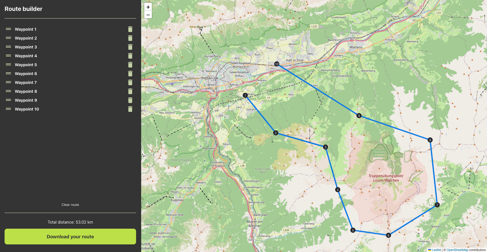
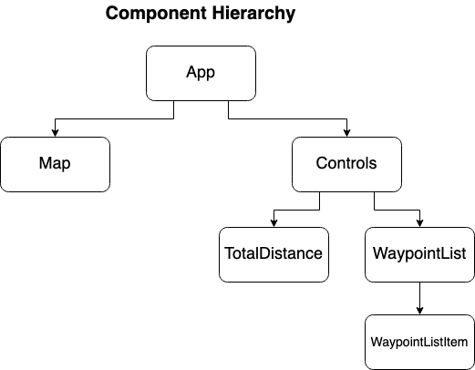
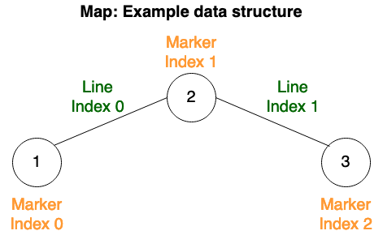

# Route builder
## Overview
Route builder enables you to plan a route for your next session of cross-country running. You can place waypoints on the map which will form your route. You can rearrange or delete them until the route looks good to you! You will get to know the distance of your route as the crow flies and can download the route as a GPX file.  

[](docs/Screenshot.png)  

## Getting started with the code
`yarn install` to install the dependencies  
`yarn start` to start the server locally

The app can also be accessed [here](https://aschwad.github.io/route-builder) and is deployed via GitHub Pages on every commit on the master branch.

[](docs/ComponentHierarchy.drawio.png)  

## Requirements
### Essential
- [x] Show waypoints in Map
- [x] Show waypoints in Controls
- [x] Add and remove waypoints
- [x] Connect waypoints with lines based on their order
- [x] Prepare and download route as GPX file
- [x] Change order of the waypoints in Controls section via Drag and drop
- [x] Avoid using 3rd party libraries for prebuilt components 

### Optional
- [x] Calculate distance
- [x] Drag and drop of waypoints in Map

## What I've learned
The challenge is structured mostly into the logical areas: `Map` and `Controls`. In the following, I will briefly explain each area's key logic and my learnings.

### Map
Visualizing a map with markers and lines without the `react-leaflet` library required more research of the standard leaflet documentation. But it was easier to solve than I initially expected. Critical moments to solve the task were the following:
* Using a Ref for the map component enabled me to programmatically manipulate the shown elements on the map whenever the waypoints changed.
* The approach to re-render all elements on the map as soon as one waypoint changes was easy to implement, but might run into performance issues for large routes with a very high quantity of waypoints.
* Drawing a circle with a label for the waypoints was harder than expected, but more research of the documentation led to the solution via `divIcon`.
* Although the drag functionality of the waypoints was not an explicit requirement, it appeared to me as a good addition in terms of usability for the app. Making marker (waypoint representation in Map) draggable in leaflet is easy, but updating the connected lines to the dragged marker was a bit more complicated. I kept the lines and marker in separate arrays and applied the following approach for updates:
  
[](docs/ExampleDataStructure.drawio.png)  
```
// Simplified form
markers = [0,1,2]
lines = [0,1]
```
For example, when the marker with `index=1` (M1) is dragged, the lines at `index=0` (line inbound to M1) and `index=1` (line outbound from M1) have to be updated.  
In summary: When updating the marker at index `i`, the lines at `i` and `i-1` have to be updated, if existent. After determining the affected lines of the dragged marker, the lines are removed and re-rendered with the new position of the marker.
### Controls
Implementing the controls without a component/styling library like `material-ui` or `tailwind css` refreshed my CSS skills, but took me a bit more time than usual. By using the basic HTML interfaces, the drag and drop functionality was easier to implement than expected. Libraries like `react-dnd` or `framer motion` certainly would accelerate this process, but I appreciate knowing the logic behind and to keep in control over the source code for trivial features.  
Lastly, I solved the functionality to provide the GPX file as a download with a rather simple approach: The metadata as a string is concatenated with each of the waypoints as string and then transformed via a `Blob`. Other solutions could have made use of e.g. `new XMLDocument` or libraries like `gpx-builder`, but do not justify the extra effort of an extra library for this trivial data export.
